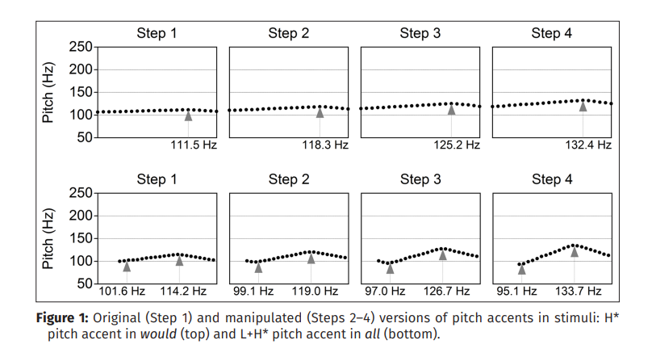
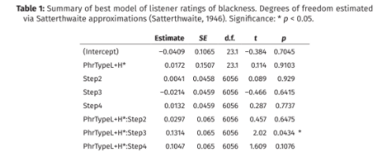

# General Information and Disclaimers

- The paper I am presenting is **"Intonational variation and incrementality in listener judgments of ethnicity" (2020)**, by **Nicole Holliday and Dan Villarreal**

- If you are interested in reading the study, please go here: https://www.dropbox.com/s/3cy96mk9gplxq8x/holliday%20and%20villarreal%202020-final.pdf?dl=0

- Throughout this presentation, I will use the following notations interchangeably: H* and H(star). 
 Unfortunately, R has its own interpretation of the asterisk, so it leads to some confusion.

---
# Outline 
--

- Abstract 

--

- Background for the study 

--

- Description of the study 

 - Research Questions 

--

- Methodology 

--

- Statistical Analysis 

 - Interpretation of the Analysis

--

- Results

 - Interpretation of the Results

--

- Conclusion

--

- References

---

# Abstract 

--

**I am including the abstract to provide more context for this study.** 

--

The current study examines how listeners make gradient and variable ethnolinguistic judgments 
in an experimental context where the speaker’s identity is well-known. It features an open-guise experiment (Soukup, 2013) that assessed whether sociolinguistic judgments are subject to 
incrementality, with judgments increasing in magnitude as variable stimuli demonstrate more 
extreme differences. In particular, this task tested whether judgments of President Barack Obama 
as sounding ‘more’ or ‘less’ black (e.g., Alim & Smitherman, 2012) are sensitive to differences in 
intonation. Half of critical stimuli featured an L+H* pitch accent, which occurs more frequently in 
African American Language than in Mainstream U.S. English (Holliday, 2016). Four stimuli apiece 
were created from these phrases by making each pitch accent more extreme by semitone-based F0 steps. Seventy-nine listeners rated these stimuli via the question, “How black does 
Obama sound here?” Mixed-effects modeling indicated that listeners rated more phonetically 
extreme L+H* stimuli as sounding blacker, regardless of listener identity. A post-hoc analysis 
found that listeners attended to different voice quality features in L+H* stimuli. We discuss 
implications for research in intonation, ethnic identification, incrementality, language attitudes, 
and sociolinguistic awareness.

---

# Background for the study (1)

--

- Perceptual sociolinguistic/ sociophonetic study 

--

- It employs the auto-segmental/metrical (AM) intonational framework 
(Pierrehumbert, 1980) 

--

- Intonational variation serves to index various ethnic identities (Burdin, 
2015; Holliday, 2016; Reed, 2016) 

--

- U.S. listeners can distinguish African American and white voices (see Thomas and Reaser, 2004) 

--

 - rather accurately (70-100%)

--

- However, speaker-specific variables are difficult to pinpoint (Holliday and Jaggers, 2015)

---

# Background for the study (2)

--

- In production studies, the L + H* pitch accent - resource for performance of African American identity (Holliday, 2016). 

--

- L+H* has been identified as more prevalent in AAL (African American Language) than in MAE (Mainstream American English). 

--

- Previous studies have not considered the *incrementality* of social meaning.

--

  -  One reason is that socially marked variables (e.g., /ɹ/ vocalization) have been predominantly viewed as categorical (e.g., present or absent) instead of gradient.

--

- This study examines how listeners:

 - evaluate ethnicity based on intonational variation 
 
 - assign social meaning to gradient phonetic variation.

---

# Description of the study 

--

- Listeners rated speech samples of former U.S. President Barack Obama "on the degree of *sounding black*" (p. 2)
 - Obama is known to be able to command both AAL and MAE varieties (Alim and Smitherman, 2012)

- The critical stimuli included at least one or more L+H(star) pitch accents or no L+H(star) pitch accents. 

--

### Research Questions

--

**RQ 1. How do pitch accents affect listener judgments of ethnic identity? In particular, does the L+H* pitch accent carry a social meaning of blackness in perception, as it does in production?**

--

RQ 2.  To what extent are the ethnicity-based social meanings of these pitch accents mediated by incremental phonetic differences?

--

RQ 3.  What other aspects of voice quality affect listener judgments of ethnicity?

---

# Methodology (1)

--

- Perceptual task

--

 - open-guise technique (OGT) (Soukup, 2013)

--

     - "relative" of the MGT (matched-guise test)

     - Participants are informed that they are listening to the same speaker in different guises

 - Since the stimulus speaker was former U.S. President Barack Obama, the assumption was that the listeners (all from the U.S.) would be familiarized with his voice.

     - An OGT was deemed more appropriate than an MGT.
 
---

# Methodology (2)

--

### Materials

- 120 stimuli based on excerpts of Barack Obama's spontaneous speech from two different TV interviews from 2016

 - each stimulus based on a single Intonational Phrase (IP) unit
 
 - ranging from 0.4 to 2.3 seconds (median: 0.9 seconds)
 
 - four manipulation steps for the critical stimuli (see Figure 1, next slide)
     - with the original excerpt as Step 1.
     
     - Steps 2, 3, and 4 were created by making pitch accents’ F0 minima and maxima successively more extreme. 
     
     - With each manipulation step, H* and L+H* maxima were increased by a semitone, and L+H* minima were decreased by a half-semitone

---
#Methodology (3)

```{r, message=FALSE, echo=FALSE, warning=FALSE}



```
---

# Methodology (4)

--

### Task design

- Online survey

- Listeners heard a single stimulus auto-play twice

- Then, they responded to the question "How black or white does Obama sound here?" on a continuous unit-less slider bar

 - "very black" and "very white" on opposite poles


---

# Statistical analysis (1)

--

- comparison of linear mixed-effects models of standardized ratings to find the predictor structure that best modeled the data in critical trials

 - the predictors tested were:

     - phrase types: H(star) versus L+H(star)
     
     - manipulation step
     
     - edge tone
     
     - nuclear pitch
     
     - stimulus duration
     
     - numerous listener effects (e.g., participants' race, gender, etc.)

---

# Statistical analysis (2)

Table 1 summarizes the best model for listener rates of blackness for the following predictors: phrase type, manipulation step, and their interaction.

```{r, message=FALSE, echo=FALSE, warning=FALSE}

```

---

#Statistical analysis (3)

- As you can observe in Table 1, only PhrTypeL+H*: Step 3 was significant.
 - It had a p value slightly under 0.05
 - It differed from the intercept by approximately 0.17 SDs (in the authors' words, this would be the equivalent of "about 3 'notches' on the 0-100 slider bar")
   - the average SD was 16.6
   
- After doing an R2 calculation with the R package piecewiseSEM, the authors reported that: 
 - the model's fixed-effects predictor structure accounted for less than 1% of the variance in ratings
 - random effects (e.g., the effect of individual excerpts) accounted for 11.3% of the variance

--

Remember, R2 (the coefficient of determination) is the variance explained by the model and provides an overall assessment of model fit. 

---

# Interpretation of the Statistical Analysis (1)

### Explanation of analysis

- What did they do?

 - From my understanding, the authors did a GLMM and they compared linear mixed-effects models. 


- Why did they do it?

 - A GLMM was appropriate because the authors were looking at fixed and random effects.
---

# Interpretation of the Statistical Analysis (2)

### Appropriateness/novelty of analysis

- Given what you know/what you have previously read, was this the best analysis?

 - From what I know so far, I think this was an appropriate analysis. Perhaps it can be improved, but I am unsure at this point how.

 - One thing that I thought was interesting was that they included random intercepts for the excerpts, since each excerpt belonged to only one of the two phrase types.

- Did they do something you haven’t seen before? 

 - The authors did mention Satterthwaite approximations, which I had not heard of before. I looked this up and found that it is a way to account for two different sample variances.

---

# Results

- For this presentation, I am referring only to the results for *phrase type* and *manipulation step*.

--

.pull-left[

## Phrase type


- The authors reported no main effect of phrase type on listener ratings of blackness.

 - This indicates that pitch accent alone did not trigger different blackness ratings]

--

.pull-right[

## Manipulation Step


- The authors reported a significant interaction between phrase type and manipulation step.

 - More extreme L+H(star) phrases were rated as "blacker" than less extreme L+H(star) phrases.
 - There was no perceived blackness difference for H* phrases regardless of step. 
]
---

# Interpretation of Results

- I thought the results were presented in eloquent prose and complemented the tables and graphs well. 


- Another thing I liked is that the authors mentioned the caveats and implications of their analysis (and results).

---

# Conclusion - Overall impression of the study

- Great reasoning for choosing the OGT instead of the MGT. 

 - However, it could be argued that there are several limitations to the OGT, particularly, when the speaker is a former U.S. president (i.e., personal affiliations can come into play).
 
- For what I understand so far, I thought the analysis was adequate. 

 - The authors do not share their code for any of the stats they did. However, all of the studies (co-)authored by Nicole Holliday are open access, so that is still a win!
- For a sociolinguistic study, the authors actually provided very little information about the participants. 

- Similarly, they mentioned having collected qualitative data from the participants as well, but it is not elaborated.

---

# References (1)

- Alim, H. S., & Smitherman, G. (2012). Articulate While Black: Barack Obama, Language, and Race in the U.S. Oxford: Oxford University Press.

- Burdin, R. (2015). Phonological and phonetic variation in list intonation in Jewish English. Paper presented at NWAV 44. Toronto. DOI: https://doi.org/10.21437/SpeechProsody.2014-175.

- Holliday, N. (2016). Intonational Variation, Linguistic Style, and the Black/Biracial Experience. (Doctoral dissertation), New York University.

- Holliday, N., & Jaggers, Z. S. (2015). Influence of suprasegmental features on perceived ethnicity of American politicians. Paper presented at 18th International Congress of Phonetic Sciences, Glasgow, Scotland.

- Pierrehumbert, J. B. (1980). The phonology and phonetics of English intonation. (Doctoral dissertation), Massachusetts Institute of Technology, Cambridge, MA.

---

# References (2)

- Reed, P. (2016). Sounding Appalachian: /aI/ Monophthongization, Rising Pitch Accents, and Rootedness. (Doctoral dissertation), University of South Carolina.

- Satterthwaite, F. E. (1946). An Approximate Distribution of Estimates of Variance Components. Biometrics Bulletin, 2(6), 110–114. DOI: https://doi.org/10.2307/3002019

- Soukup, B. (2013). ‘Matched guise technique’ vs. ‘Open guise technique’ in the elicitation of language attitudes: Insights from a comparative study. Paper presented at ExAPP 2, Copenhagen.

- Thomas, E. R., & Reaser, J. (2004). Delimiting perceptual cues used for the ethnic labeling of African American and European American voices. Journal of Sociolinguistics, 8(1), 54–87. DOI: https://doi.org/10.1111/j.1467-9841.2004.00251.x

